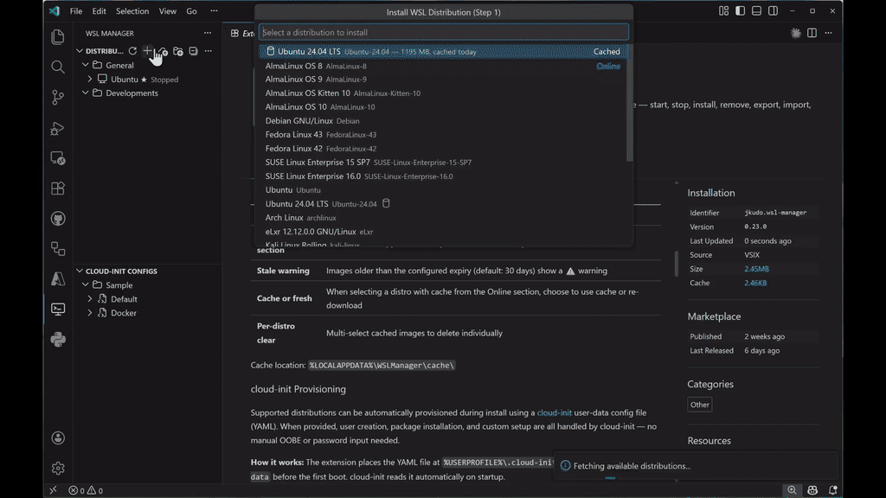

# WSL Manager for VS Code

Manage your Windows Subsystem for Linux distributions directly from the VS Code sidebar.



## Features

### Sidebar View

Click the WSL icon in the Activity Bar to see all installed distributions with their name (★ for default), state (Running / Stopped), and WSL version (1 / 2). The list refreshes automatically at a configurable interval.

### Lifecycle Management

| Action | Description |
|--------|-------------|
| **Start** | Start a stopped distribution |
| **Stop** | Stop a running distribution |
| **Shutdown All** | Stop all running WSL instances at once |

### Install with Custom Instance Name

Install new distributions from the online catalog (`wsl --list --online`) and assign a custom instance name. The extension automatically detects your WSL version and selects the best installation strategy:

| WSL Version | Strategy | User Setup |
|-------------|----------|------------|
| **2.4.4+** | `wsl --install --name` (native) | OOBE via terminal |
| **< 2.4.4** | export → import flow (legacy) | `useradd` + `chpasswd` |

When cloud-init or a cached image is used, the flow adapts accordingly — see sections below.

### Distribution Image Cache

Caches distribution images locally after the first download to speed up repeated installs and save bandwidth.

| Behavior | Description |
|----------|-------------|
| **Auto-save** | After a fresh install, the clean image is exported and cached |
| **Cached section** | Cached distros appear at the top of the install list for quick access |
| **Stale warning** | Images older than the configured expiry (default: 30 days) show a ⚠️ warning |
| **Cache or fresh** | When selecting a distro with cache from the Online section, choose to use cache or re-download |
| **Per-distro clear** | Multi-select cached images to delete individually |

Cache location: `%LOCALAPPDATA%\WSLManager\cache\`

### cloud-init Provisioning

Supported distributions can be automatically provisioned during install using a [cloud-init](https://cloud-init.io/) user-data config file (YAML). When provided, user creation, package installation, and custom setup are all handled by cloud-init — no manual OOBE or password input needed.

**How it works:** The extension places the YAML file at `%USERPROFILE%\.cloud-init\<instanceName>.user-data` before the first boot. cloud-init reads it automatically on startup.

**Supported distributions:**

- AlmaLinux 8 / 9 / 10
- Fedora Linux
- Ubuntu 20.04 / 22.04 / 24.04 LTS
- Oracle Linux 8 / 9
- openSUSE Leap 15.6 / 16.0, Tumbleweed
- SUSE Linux Enterprise 15 / 16
- eLxr

**Example cloud-init config:**

```yaml
#cloud-config

locale: ja_JP.UTF-8
timezone: Asia/Tokyo

users:
  - name: dev
    groups: [adm, sudo]
    sudo: ALL=(ALL) NOPASSWD:ALL
    shell: /bin/bash

write_files:
  - path: /etc/wsl.conf
    append: true
    content: |
      [user]
      default=dev

packages:
  - git
  - curl
  - build-essential

runcmd:
  - sudo -u dev git config --global init.defaultBranch main
```

### cgroup v1 Management

Automatically adds `kernelCommandLine = cgroup_no_v1=all` to `.wslconfig` on every install. This can also be toggled on or off manually with the **Toggle cgroup v1** command, which optionally restarts WSL to apply the change.

### Distribution Management

| Action | Description |
|--------|-------------|
| **Remove** | Unregister a distribution with double confirmation (type the name to confirm) |
| **Set as Default** | Change the default WSL distribution |
| **Convert WSL Version** | Switch a distribution between WSL 1 and WSL 2 |

### Backup & Restore

| Action | Description |
|--------|-------------|
| **Export** | Export a distribution to tar or VHDX format |
| **Import** | Import a distribution from a tar or VHDX file |

### Development Tools

| Action | Description |
|--------|-------------|
| **Open Terminal** | Launch the distribution in the VS Code integrated terminal (opens in home directory) |
| **Open in VS Code (WSL)** | Connect to the distribution via the WSL remote extension |
| **Edit .wslconfig** | Edit global WSL settings (`%USERPROFILE%\.wslconfig`) |
| **Edit wsl.conf** | Edit per-distribution settings (opens via `vscode-remote://`) |

## Usage

### From the Sidebar

1. Click the WSL icon in the Activity Bar
2. Right-click a distribution to open the context menu
3. Hover over a distribution to reveal inline action buttons (terminal, start/stop)

### From the Command Palette

`Ctrl+Shift+P` → type `WSL Manager:` to see all available commands.

### Install Wizard Flow

```
Step 1: Select distribution (Cached / Online)
Step 2: Enter custom instance name
Step 3: Select cloud-init config (optional, supported distros only)
Step 4: Cache/fresh choice or install directory (if applicable)
Step 5: Username + password (only when no cloud-init and no OOBE)
  ↓
Install → Configure .wslconfig → User setup or cloud-init → Ready
```

## Settings

| Setting | Default | Description |
|---------|---------|-------------|
| `wslManager.autoRefreshInterval` | `30` | Auto-refresh interval in seconds (5–300) |
| `wslManager.confirmBeforeRemove` | `true` | Require double confirmation before removing a distribution |
| `wslManager.defaultExportFormat` | `tar` | Default export format (`tar` or `vhdx`) |
| `wslManager.showInlineActions` | `true` | Show inline action buttons in the tree view |
| `wslManager.cache.enabled` | `true` | Cache distribution images locally |
| `wslManager.cache.expiryDays` | `30` | Days before a cached image is considered stale (1–365) |

## Requirements

- Windows 10 (21H2+) or Windows 11
- WSL installed and enabled
- VS Code 1.85.0 or later

## License

MIT
