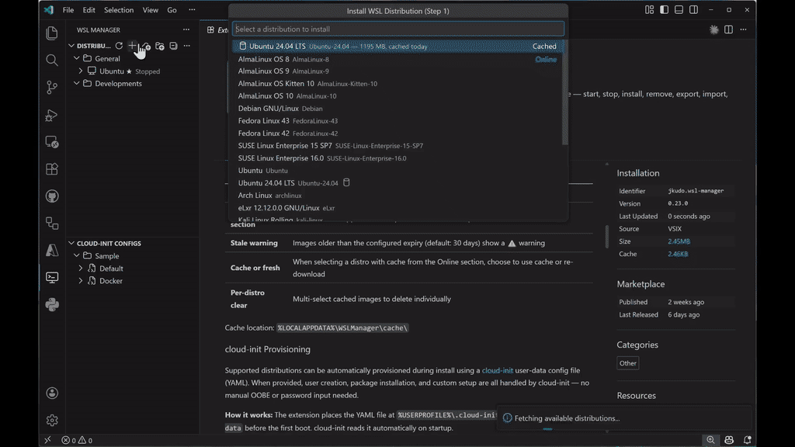

# WSL Manager for VS Code

Manage your Windows Subsystem for Linux distributions directly from the VS Code sidebar.

> **Note:** This is a community-developed extension and is not affiliated with, endorsed by, or supported by Microsoft. "Windows Subsystem for Linux" and "WSL" are trademarks of Microsoft Corporation.



## Features

### Sidebar View

Click the WSL icon in the Activity Bar to see all installed distributions with their name (★ for default), state (Running / Stopped), and WSL version (1 / 2). The list refreshes automatically at a configurable interval.

### Lifecycle Management

| Action | Description |
|--------|-------------|
| **Start** | Start a stopped distribution |
| **Stop** | Stop a running distribution |
| **Shutdown All** | Stop all running WSL instances at once |

### WSL Containers (Preview)

If your WSL version includes the [WSL container](https://learn.microsoft.com/en-us/windows/wsl/wsl-container) preview feature (`wslc.exe`), the sidebar shows **Containers** and **Images** sections:

| Action | Description |
|--------|-------------|
| **Run New Container** | Pick an image (or enter a reference), optionally set a name and port mapping — the container starts detached |
| **Run Interactive Container** | Start a new container from an image and land directly in its shell in a terminal (works even for images whose default command exits immediately) |
| **Start / Stop** | Manage the container lifecycle |
| **Open Shell** | Open a terminal inside a running container (bash if available, otherwise sh) |
| **Connect VS Code** | Attach a VS Code window to a running container via the Dev Containers extension (pre-release version required — see Requirements) |
| **Show Logs** | View recent container logs in an output channel |
| **Remove / Prune** | Remove a container or all stopped containers |
| **Image actions** | Run a container from an image, remove an image, prune unused images |

If `wslc.exe` is not detected, a hint entry appears instead — WSL containers currently require the WSL pre-release channel (`wsl --update --pre-release`). The sections can be hidden with the `wslManager.containers.enabled` setting.

#### What "Connect VS Code" changes on your machine

Attaching VS Code to a container goes through the Dev Containers extension, so this command touches two things outside this extension. Both are disclosed here because they affect other tools:

| Change | Details |
|--------|---------|
| `dev.containers.dockerPath` | Set to `wslc.exe` so Dev Containers drives WSL containers instead of Docker. **Global setting** — you are asked before it is changed, the previous value is remembered, and **"WSL Manager: Restore Dev Containers Docker Path"** puts it back. While it points at wslc, Dev Containers will not manage Docker containers. |
| A per-container attach config | A minimal `{}` file is created in the Dev Containers extension's storage (`nameConfigs/<container>.json`) — the same file its own "Open Attach Container Configuration File" command creates. This works around a gap in wslc 2.9.4, whose `inspect` output omits `Config.Image` and makes Dev Containers fail with a `TypeError`. It is only created when that field is actually missing, and existing files are never overwritten. |

### Install with Custom Instance Name

Install new distributions from the online catalog (`wsl --list --online`) and assign a custom instance name. The extension automatically detects your WSL version and selects the best installation strategy:

| WSL Version | Strategy | User Setup |
|-------------|----------|------------|
| **2.4.4+** | `wsl --install --name` (native) | OOBE via terminal |
| **< 2.4.4** | export → import flow (legacy) | `useradd` + `chpasswd` |

When cloud-init or a cached image is used, the flow adapts accordingly — see sections below.

### Distribution Image Cache

Caches distribution images locally after the first download to speed up repeated installs and save bandwidth.

| Behavior | Description |
|----------|-------------|
| **Auto-save** | After a fresh install, the clean image is exported and cached |
| **Cached section** | Cached distros appear at the top of the install list for quick access |
| **Stale warning** | Images older than the configured expiry (default: 30 days) show a ⚠️ warning |
| **Cache or fresh** | When selecting a distro with cache from the Online section, choose to use cache or re-download |
| **Per-distro clear** | Multi-select cached images to delete individually |

Cache location: `%LOCALAPPDATA%\WSLManager\cache\`

### cloud-init Provisioning

Supported distributions can be automatically provisioned during install using a [cloud-init](https://cloud-init.io/) user-data config file (YAML). When provided, user creation, package installation, and custom setup are all handled by cloud-init — no manual OOBE or password input needed.

**How it works:** The extension places the YAML file at `%USERPROFILE%\.cloud-init\<instanceName>.user-data` before the first boot. cloud-init reads it automatically on startup.

**Only images that ship cloud-init can use this.** WSL merely puts the file where cloud-init looks; if the image does not include cloud-init (openSUSE Leap 16.0, for example), the file is never read. The extension checks for cloud-init right after installing and, when it is missing, falls back to the distribution's own initial setup: it opens a terminal so the first-run wizard (`[oobe] command` in the image's `wsl-distribution.conf`) can create the user the way the distribution intends. It does not create users by itself in that case. The same fallback applies when cloud-init ran but created no user.

**Config Management:** The sidebar includes a "Cloud-Init Configs" section where you can manage your configs:

| Action | Description |
|--------|-------------|
| **Import** | Import a YAML file as a saved config (+ button in title bar) |
| **Edit** | Open config directly in VS Code (saved to storage on Ctrl+S) |
| **Export** | Save config to a YAML file |
| **Duplicate** | Create a copy of an existing config |
| **Rename** | Change the display name |
| **Delete** | Remove a config |
| **Group** | Organize configs into groups with drag and drop |

Two built-in sample configs are included: "Default" (common development tools) and "Docker" (Default + Docker CE). Configs are stored as YAML files in `%APPDATA%\Code\User\globalStorage\jkudo.wsl-manager\cloud-init\`.

When installing from cache with cloud-init, the extension automatically resets cloud-init state and runs all stages in the background — no manual terminal interaction needed.

**Supported distributions:**

- AlmaLinux 8 / 9 / 10
- Fedora Linux
- Ubuntu 20.04 / 22.04 / 24.04 LTS
- Oracle Linux 8 / 9
- openSUSE Leap 15.6 / 16.0, Tumbleweed
- SUSE Linux Enterprise 15 / 16
- eLxr

**Example cloud-init config:**

```yaml
#cloud-config

locale: ja_JP.UTF-8
timezone: Asia/Tokyo

users:
  - name: dev
    groups: [adm, sudo]
    sudo: ALL=(ALL) NOPASSWD:ALL
    shell: /bin/bash

write_files:
  - path: /etc/wsl.conf
    append: true
    content: |
      [user]
      default=dev

packages:
  - git
  - curl
  - build-essential

runcmd:
  - sudo -u dev git config --global init.defaultBranch main
```

### cgroup v1 Management

Automatically adds `kernelCommandLine = cgroup_no_v1=all` to `.wslconfig` on every install. This can be changed in **WSL Settings** under the Kernel section.

### WSL Settings Editor

A VS Code-style settings GUI for `.wslconfig`. Open from the `…` menu → **WSL Settings**.

| Category | Settings |
|----------|----------|
| **Memory & CPU** | Memory, Processors, Swap, Swap File Path |
| **Networking** | Networking Mode (NAT/Mirrored), DNS Tunneling, DNS Proxy, Firewall, Auto Proxy, Localhost Forwarding |
| **Virtualization** | Nested Virtualization, GUI Applications (WSLg), VM Idle Timeout |
| **Disk** | Sparse VHD |
| **Kernel** | Custom Kernel, Kernel Command Line |
| **Experimental** | Auto Memory Reclaim, Host Address Loopback |

### Grouping

Organize distributions into custom groups displayed as folders in the sidebar. Drag and drop to move distributions between groups or reorder them.

| Action | Description |
|--------|-------------|
| **Create Group** | Add a new group (from title bar or Command Palette) |
| **Rename Group** | Rename a group (right-click on group) |
| **Delete Group** | Remove a group; its distributions move to the default group |
| **Drag & Drop** | Move distributions between groups or reorder groups/distributions |

A default group ("General") always exists and cannot be deleted. New distributions are assigned to a group during the install wizard. If only one group exists, assignment is automatic.

### Distribution Management

| Action | Description |
|--------|-------------|
| **Remove** | Unregister a distribution with double confirmation (type the name to confirm; can be relaxed with `wslManager.confirmBeforeRemove`) |
| **Remove Multiple** | Bulk-remove selected distributions (from `…` menu or Command Palette) |
| **Set as Default** | Change the default WSL distribution |
| **Convert WSL Version** | Switch a distribution between WSL 1 and WSL 2. Shown in the context menu only for WSL 1 distributions; always available from the Command Palette |

### Backup, Restore & Clone

| Action | Description |
|--------|-------------|
| **Export** | Export a distribution to tar or VHDX format |
| **Import** | Import a distribution from a tar or VHDX file |
| **Clone** | Duplicate an existing distribution with optional user configuration |

### Development Tools

| Action | Description |
|--------|-------------|
| **Open Terminal** | Launch the distribution in the VS Code integrated terminal (opens in home directory) |
| **Connect to WSL** | Open a VS Code window connected to the distribution via the WSL remote extension. For distributions with interop disabled it connects over SSH instead (see [Connecting when interop is disabled](#connecting-when-interop-is-disabled-remote-ssh)) |
| **Connect to WSL via SSH** | Connect over the Remote - SSH extension regardless of the interop setting; sets up sshd inside the distribution on first use |
| **WSL Settings** | Visual settings editor for `.wslconfig` |
| **Edit wsl.conf** | Edit per-distribution settings in a local copy; saving writes it back to `/etc/wsl.conf` as root and offers to restart the distribution. Works when the default user is not root, and independently of the automount/interop settings that wsl.conf itself controls |

### Connecting when interop is disabled (Remote-SSH)

Setting `[interop] enabled=false` in wsl.conf keeps tools inside the distribution (Claude Code, npm, git, …) from ever seeing Windows executables or `/mnt/c`. It also breaks the WSL remote extension: its server startup script needs Windows executables and `/mnt/c`, so the window fails with *WebSocket close with status code 1006*.

WSL Manager handles this by connecting through the [Remote - SSH](https://marketplace.visualstudio.com/items?itemName=ms-vscode-remote.remote-ssh) extension instead:

- The tree shows an **Interop: disabled** detail row for such distributions, **Connect to WSL** is greyed out in the context menu, and **Connect to WSL via SSH** is the one to use (from the Command Palette, **Connect to WSL** switches automatically).
- **First use** asks for confirmation, then prepares the distribution: installs `openssh-server` and, if the image lacks them, `tar`/`gzip`/`curl` (the VS Code Server cannot be unpacked without them); configures sshd on a port of its own with key authentication only; authorizes your `~/.ssh/id_ed25519.pub` (generated if missing) for the default user.
- On the Windows side it writes a `Host wsl-<distro>` entry into a marked block of `~/.ssh/config`, registers the host in `remote.SSH.remotePlatform`, checks the connection with `ssh`, and opens the window.
- WSL stops a distribution once its last session ends, which would take sshd down with it, so the extension keeps a hidden background session open while the distribution is in use. **Stop** and **Shutdown All** end it.

Each distribution gets its own port (allocated from `wslManager.ssh.portRangeStart`, default 2222, and read back from the distribution's sshd configuration), so this works under both NAT and mirrored networking with nothing to keep in sync on the Windows side. Sessions opened through the extension's ssh entry also get `OPENSSL_CONF=/dev/null`, which works around a VS Code CLI hang on distributions whose OpenSSL config includes crypto-policies (openSUSE, Fedora family); nothing else is affected.

To keep using the WSL remote extension instead, turn off `wslManager.ssh.useWhenInteropDisabled` and enable that extension's scriptless startup (`"remote.WSL.experimental.scriptLessStartup": true`). **Edit wsl.conf** works either way, so you can always change the setting back.

### Supported distributions

Every distribution offered by `wsl --list --online` has been verified with both connection modes; the full table is in [docs/distro-verification.md](docs/distro-verification.md). Two things to know:

| Distribution | Note |
|--------|-------------|
| openSUSE Tumbleweed / Leap 16.0, SUSE Linux Enterprise 15 SP7 / 16.0 | The images ship without `tar` and `gzip`, which the WSL remote extension needs to unpack its server and cannot install itself. Run `sudo zypper in tar gzip` once, or use **Connect to WSL via SSH** (its setup installs them). |
| Oracle Linux 7.9 | glibc 2.17; the VS Code Server requires 2.28 or newer, so neither connection mode can run it. |

Legacy, appx-packaged distributions (Oracle Linux, SUSE Linux Enterprise 15 SP6) are installed through their launcher and then renamed with the export/import path; only Ubuntu images ship cloud-init, every other image sets up its first user through its own first-run wizard.

## Usage

### From the Sidebar

1. Click the WSL icon in the Activity Bar
2. Right-click a distribution to open the context menu
3. Hover over a distribution to reveal inline action buttons (terminal, start/stop)

### From the Command Palette

`Ctrl+Shift+P` → type `WSL Manager:` to see all available commands.

### Install Wizard Flow

```text
Step 1: Select distribution (Cached / Online)
Step 2: Enter custom instance name
Step 3: Select group (if multiple groups exist)
Step 4: Select cloud-init config (saved configs / file / skip)
Step 5: Cache/fresh choice or install directory (if applicable)
Step 6: Username + password (only when no cloud-init and no OOBE)
  ↓
Install → Configure .wslconfig → cloud-init, or the distribution's own first-run setup in a terminal → Ready
```

## Settings

| Setting | Default | Description |
|---------|---------|-------------|
| `wslManager.autoRefreshInterval` | `30` | Auto-refresh interval in seconds (5–300) |
| `wslManager.confirmBeforeRemove` | `true` | Require double confirmation before removing a distribution |
| `wslManager.defaultExportFormat` | `tar` | Default export format (`tar` or `vhdx`) |
| `wslManager.showInlineActions` | `true` | Show inline action buttons in the tree view |
| `wslManager.cache.enabled` | `true` | Cache distribution images locally |
| `wslManager.cache.expiryDays` | `30` | Days before a cached image is considered stale (1–365) |
| `wslManager.containers.enabled` | `true` | Show the Containers and Images sections (requires wslc) |
| `wslManager.containers.wslcPath` | `""` | Override the path to `wslc.exe` (advanced; empty = auto-detect) |
| `wslManager.ssh.useWhenInteropDisabled` | `true` | Connect over Remote-SSH when a distribution has `[interop] enabled=false` |
| `wslManager.ssh.portRangeStart` | `2222` | First port tried when assigning an SSH port to a distribution |

## Requirements

- Windows 10 (21H2+) or Windows 11
- WSL installed and enabled
- VS Code 1.85.0 or later

The container features are optional and detected at runtime — without them the extension works exactly as before:

| Feature | Additional requirement |
|---------|------------------------|
| Containers / Images sections | A WSL version that ships `wslc.exe` (WSL container is in public preview: `wsl --update --pre-release`) |
| Connect VS Code to Container | The [Dev Containers](https://marketplace.visualstudio.com/items?itemName=ms-vscode-remote.remote-containers) extension, **pre-release version** (it is the version that recognizes wslc as a container runtime) |
| Connect to WSL via SSH | The [Remote - SSH](https://marketplace.visualstudio.com/items?itemName=ms-vscode-remote.remote-ssh) extension and the Windows OpenSSH client (`ssh.exe`, included in Windows 10/11) |

## License

MIT
